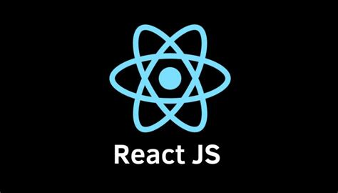
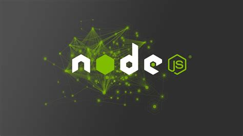
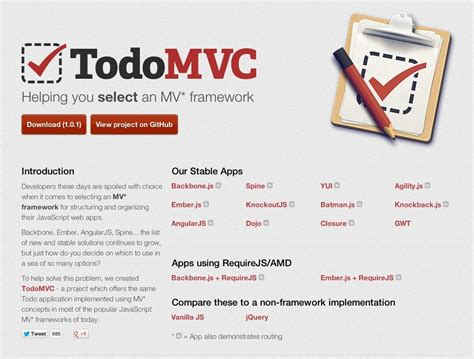
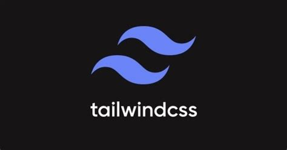
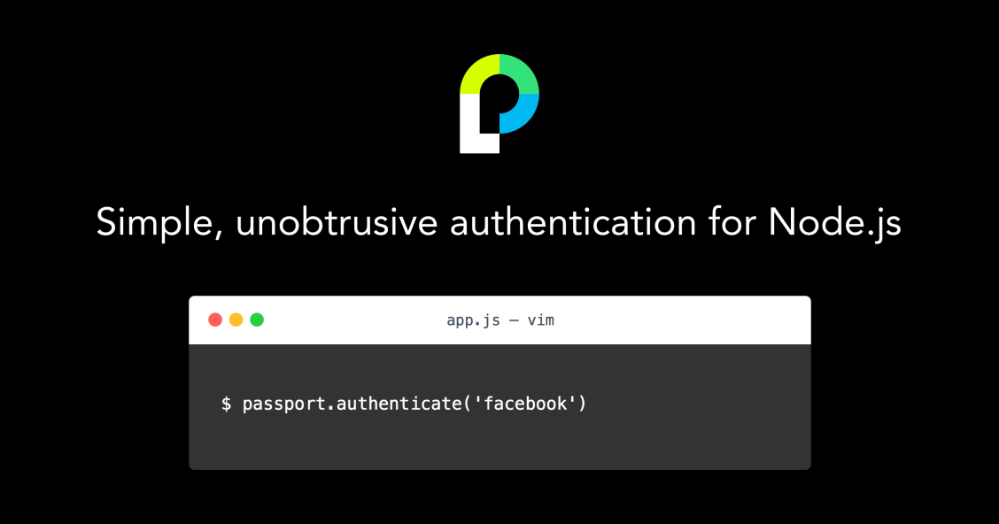
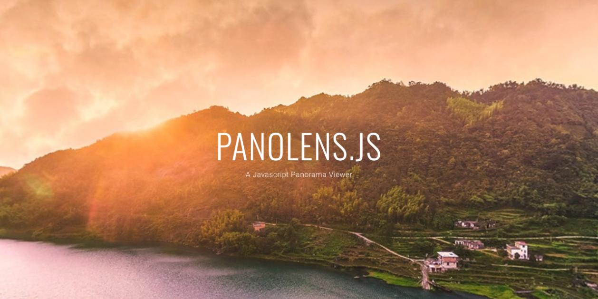
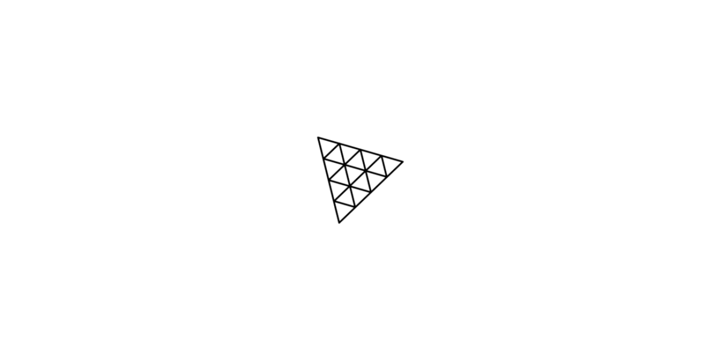
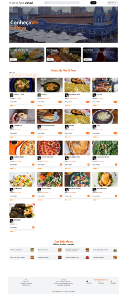
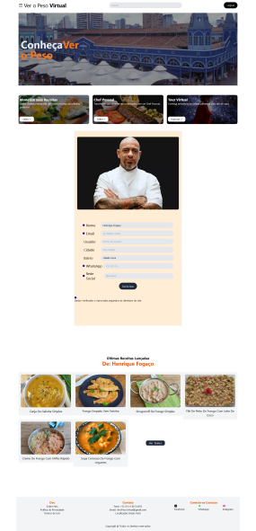
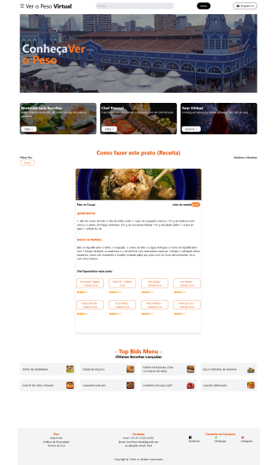

# Main - virtual-veropeso-2

## Como executar este project 
- Abra o diretório do cliente react js 
`cd client-react`

- Execute o package json para baixar as dependenciais
`npm install`

- Não esqueça do banco de dados:
- Estamos usando o SQlite

- Execute o project 
`npm start`

- Repita os passos pra rodar o server-node e virtual3D

## branch Front-end client-react

## branch Back-end server-node 
- [x] login
- [x] cadastro de user

### CRUD Usuário
- [x] Create 
- [x] Read 
- [] Update
- [] Delete

### Framework

1. autetificação
O Passport é um middleware para Node.js que facilita a implementação de autenticação e autorização.

### DB 
https://www.sqlite.org/index.html

### Panolens

### Three 

### Telas 

